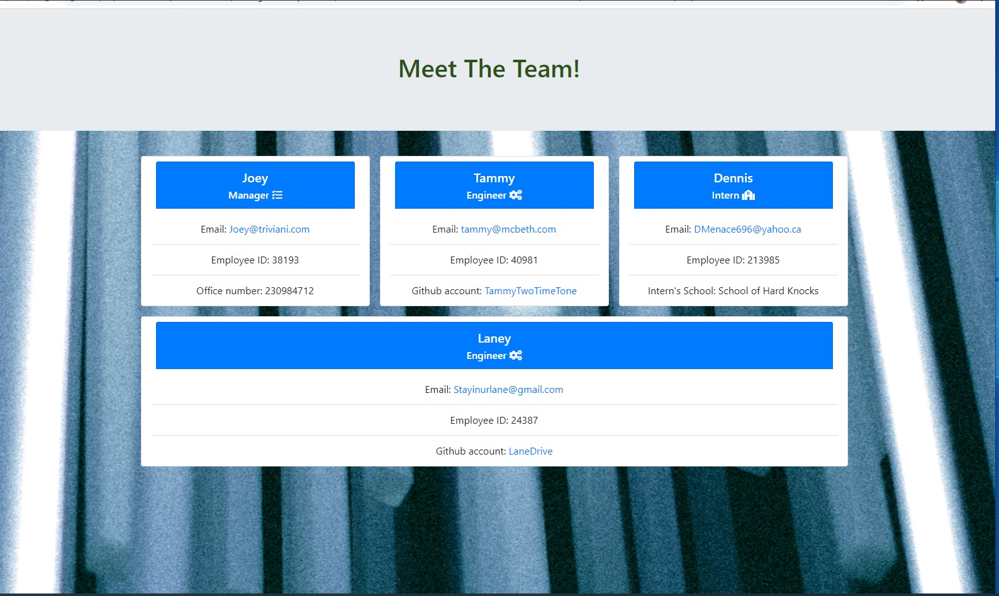

# Team Profile Builder - Bootcamp Spot - Homework #
## Author: WellAndGood

# Table of Contents
* [Overview](#overview)
* [Features](#features)
* [Files](#files)
* [Appearance](#appearance)
* [Contributors](#contributors)
* [License](#license)

## Overview

This document describes the components of a pseudo-website featuring a custom-built team, using vanilla Javascript, Node, Inquirer, Path, FS, and Jest. 

This website is meant to demonstrate knowledge and competency in the following:

- Advanced Javascript, including Classes and Class Extentions,
- Test files, using the Jest library, in order to assure that the class constructor and methods are valid,
- The use of Inquirer to gather the answers to questions surrounding team building,
- HTML using the Bootstrap library and Font Awesome.

# Features
The following are the specific steps involved in building the code:

## Javascript

- The `newTeamMember()` method, which allows you to select between a manager, engineer, or intern, or to stop adding employees;
- Choosing a manager, an engineer, or an intern launches its respective method, itself with a set of questions which gather class-specific parameters. Once complete, the data is pushed in its respective constructor. For example, the engineer's responses will be shoehorned into a `new Engineer(data.name, data.id, data.email, "Engineer", data.github` class.)
- Each additional employee class generated, including the first, are pushed into an array called `teamMembers`
- Choosing to stop adding employees launches the `teamAssembler(array)` method, passing in the `teamMembers` array.
- The `teamAssembler` function passes through the array and parses through the constructor, determining between the three types of classes. The class determines which HTML artifact will be reflected. 
    - For example, the function produces an HTML-friendly office number if the class was a Manager
    - It produces an HTML-friendly GitHub link if the class was an engineer
    - It produces an HTML-friendly school title if the class was an engineer
    - In all cases, each employee will have a clickable (`mailto`) email that directs to an email client with the employee's email 'from' address pre-filled.
    - In all cases, an HTML card is produced, with general features, class-specific features, included. This HTML card is generated repeatedly, and cumulatively, for the duration of the loop.
    - This card section is nested inside a template HTML file, which uses Bootstrap, Font Awesome, and flexbox display. 

# Files

File name | Function
------------ | -------------
index.js | Javascript file, including Inquirer, PATH and FS libraries
package.json
**lib**
Employee.js | Employee class constructor
Engineer.js | Engineer class constructor
Intern.js | Intern class constructor
Manager.js | Manager class constructor
**tests**
Employee.test.js | Employee class constructor test file (Jest)
Engineer.test.js | Engineer class constructor test file (Jest)
Intern.test.js | Intern class constructor test file (Jest)
Manager.test.js | Manager class constructor test file (Jest)
**dist***
team.html | The final-generated HTML file
html.css | The complimentary CSS file

# Appearance 
Once loaded, the generated HTML page should look like this:  
<!--  -->

This website is available at the following URL:   
https://f34rth3r34p3r.github.io/DanielsWeatherNetwork/

You can access the `.git` files at:
https://github.com/WellAndGood/Team-Profile-Generator.git

**How to contribute to the application**: Given that this application acts as homework, please do not contribute to this repository.

## Contributors
Daniel Pisani (WellAndGood)

# Contact
* GitHub account: WellAndGood

## License
This project is licensed under:

### MIT License

Copyright (c) 2021 Daniel Pisani (WellAndGood) 

Permission is hereby granted, free of charge, to any person obtaining a copy of this software and associated documentation files (the "Software"), to deal in the Software without restriction, including without limitation the rights to use, copy, modify, merge, publish, distribute, sublicense, and/or sell copies of the Software, and to permit persons to whom the Software is furnished to do so, subject to the following conditions:

The above copyright notice and this permission notice shall be included in all copies or substantial portions of the Software.

THE SOFTWARE IS PROVIDED "AS IS", WITHOUT WARRANTY OF ANY KIND, EXPRESS OR IMPLIED, INCLUDING BUT NOT LIMITED TO THE WARRANTIES OF MERCHANTABILITY, FITNESS FOR A PARTICULAR PURPOSE AND NONINFRINGEMENT. IN NO EVENT SHALL THE AUTHORS OR COPYRIGHT HOLDERS BE LIABLE FOR ANY CLAIM, DAMAGES OR OTHER LIABILITY, WHETHER IN AN ACTION OF CONTRACT, TORT OR OTHERWISE, ARISING FROM, OUT OF OR IN CONNECTION WITH THE SOFTWARE OR THE USE OR OTHER DEALINGS IN THE SOFTWARE.